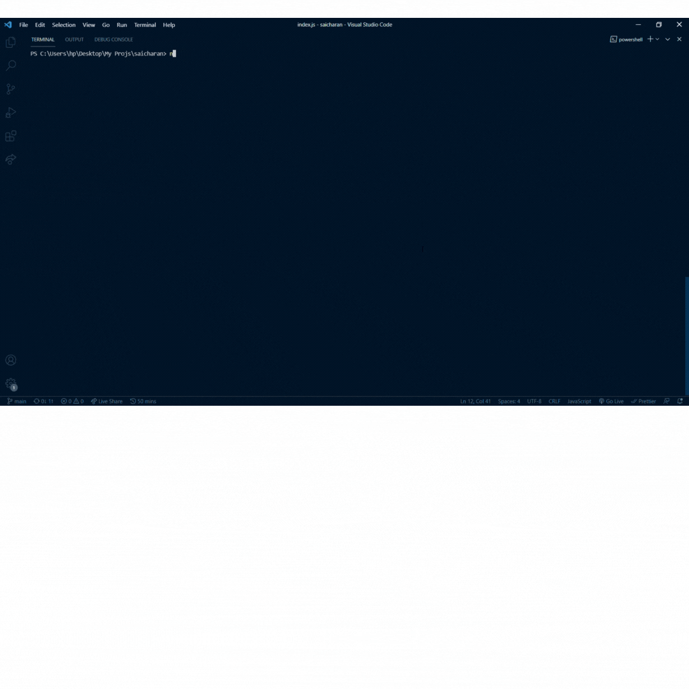

# Npx-Card

This is my NPX card which is publised as npm package. With help of this anyone can connect with me via terminal or console by typing...

```
npx saicharan

```

Below is the final output...

<p align="center">
  
</p>
